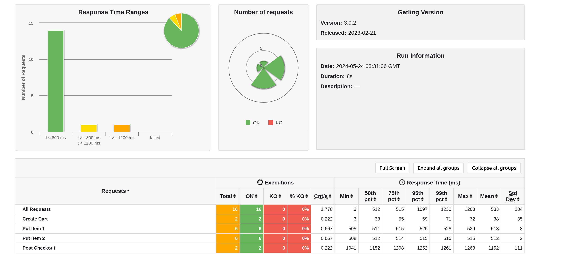
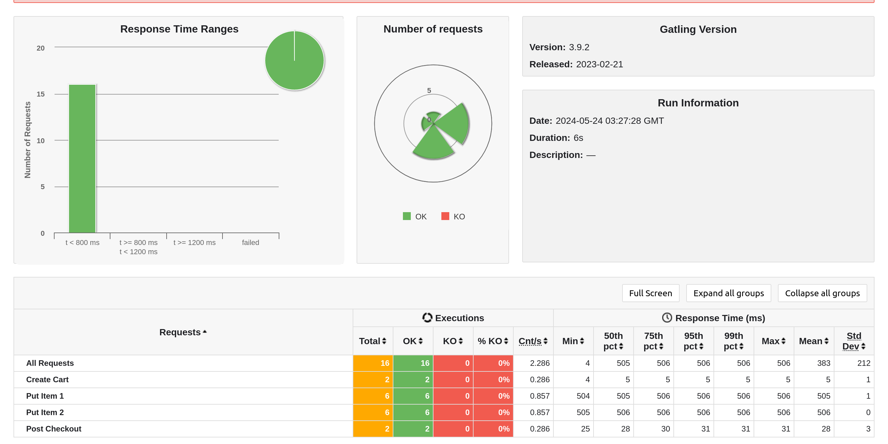

## 具体微服务架构

```mermaid
graph LR
    subgraph Users
        sources(Users)
    end
    subgraph POS Gateway
        gateway(POS Gateway)
    end
    subgraph Cart Service
        carts(Cart Service)
    end
    subgraph Product Service
        products(Product Service)
    end
    subgraph Counter Service
        counter(Counter Service)
    end
    subgraph Discovery service
        discovery(Discovery Service)
    end
    sources --> gateway
    gateway -->|route| carts
    gateway -->|route| products
    carts --> counter
    gateway -->|regiter| discovery
    products -->|register| discovery
    counter -->|register| discovery
    carts -->|register| discovery
```
[^(借鉴了老师的视频)]:https://www.bilibili.com/video/BV1Ti4y1m7Ar/?spm_id_from=333.999.0.0s 

我的系统总共包括products，counter，carts，discovery，gateway这几个服务[^(借鉴了老师的视频)]，它们分别负责以下功能：

- products：提供POS系统中的产品管理服务，包括查询，添加，修改，删除等操作。
- counter：提供POS系统中的结帐服务，包括计算总价，生成订单，支付等操作。
- carts：提供POS系统中的购物车服务，包括添加，移除，清空等操作。
- discovery：提供服务注册和发现的功能，使用Eureka作为注册中心，让各个服务可以动态地注册和发现彼此。
- gateway：提供统一的网关服务，使用Spring Cloud Gateway作为网关框架，对用户的请求进行路由和过滤，并实现负载均衡和断路器等功能。
- pos-api：它使用OpenAPI来定义了所有pos服务所需要的接口，并生成了统一的数据传输格式（DTO），避免了结构之间的耦合。这样，我可以在不修改pos-api的情况下，灵活地更换或扩展pos服务的实现。

## 服务间通信
因为products、carts之间需要经常的通信，我选择RestTemplate来进行服务间的通信，RestTemplate简化了与http服务的通信方式，统一了RESTful的标准，封装了http链接，我只需要传入url及返回值类型即可。

我还用了@LoadBalanced注解，它是一个标记注解表示被注解的RestTemplate可以使用lb+服务名作为URL的逻辑标识符; 它可以让RestTemplate自动从Eureka服务器获取服务实例的信息，并根据负载均衡策略选择一个实例来调用。

```java
Double total = restTemplate.postForObject("lb://pos-counter/api/counter/checkout", request, Double.class);
```

## 断路器使用

我在application.yml文件中定义了三个路由，分别对应三个不同的服务：pos-carts，pos-products和pos-counter。每个路由都有一个CircuitBreaker过滤器，用来指定断路器的名称和降级的URI。然后我在resilience4j.circuitbreaker.instances下配置了每个断路器的参数，例如滑动窗口大小，失败率阈值，开启状态的等待时间等。这样，当我通过gateway调用这些服务时，如果某个服务出现故障或超时，断路器就会打开，并将请求转发到fallbackUri指定的地址，从而实现了服务的容错和降级。这里的fallbackUri是我在gateway实现的controller里处理的。

## 水平扩展效果验证
为了更好的查看效果，我在每个函数中加入了一个sleep函数，模拟了服务的延迟，然后将各个服务启动一个实例，然后通过gatling进行测试，测试结果如下：


接着我利用docker启动了两个products服务实例(对应的docker-compose.yml在pos-products目录下)，然后通过gatling进行同样的测试，测试结果如下：


可以看到，当我将products服务的实例数量增加到两个时，响应时间都<800ms,这说明对单个微服务进行水平扩展可以有效提高系统的性能。