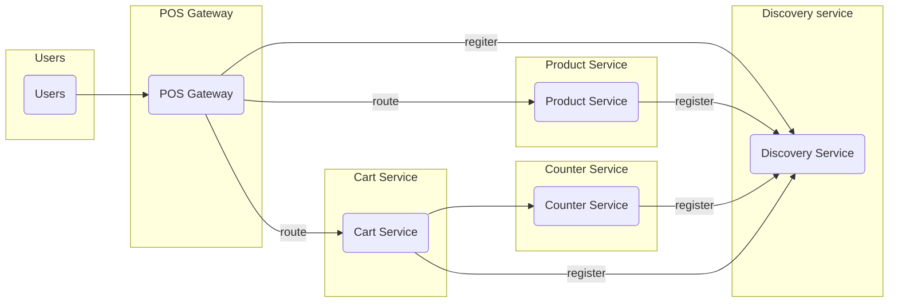

## 具体微服务架构

我的系统总共包括products，counter，carts，discovery，gateway这几个服务，它们分别负责以下功能：

- products：提供POS系统中的产品管理服务，包括查询，添加，修改，删除等操作。
- counter：提供POS系统中的结帐服务，包括计算总价，生成订单，支付等操作。
- carts：提供POS系统中的购物车服务，包括添加，移除，清空等操作。
- discovery：提供服务注册和发现的功能，使用Eureka作为注册中心，让各个服务可以动态地注册和发现彼此。
- gateway：提供统一的网关服务，使用Spring Cloud Gateway作为网关框架，对用户的请求进行路由和过滤，并实现负载均衡和断路器等功能。
- pos-api：它使用OpenAPI来定义了所有pos服务所需要的接口，并生成了统一的数据传输格式（DTO），避免了结构之间的耦合。这样，我可以在不修改pos-api的情况下，灵活地更换或扩展pos服务的实现。

## 服务间通信
因为products、carts之间需要经常的通信，我选择RestTemplate来进行服务间的通信，RestTemplate简化了与http服务的通信方式，统一了RESTful的标准，封装了http链接，我只需要传入url及返回值类型即可。

我还用了@LoadBalanced注解，它是一个标记注解，表示被注解的RestTemplate应该使用RibbonLoadBalancerClient来与服务交互，这样可以使用服务名作为URL的逻辑标识符; 它可以让RestTemplate自动从Eureka服务器获取服务实例的信息，并根据负载均衡策略选择一个实例来调用。

## 断路器使用

我在application.yml文件中定义了三个路由，分别对应三个不同的服务：pos-carts，pos-products和pos-counter。每个路由都有一个CircuitBreaker过滤器，用来指定断路器的名称和降级的URI。然后我在resilience4j.circuitbreaker.instances下配置了每个断路器的参数，例如滑动窗口大小，失败率阈值，开启状态的等待时间等。这样，当我通过gateway调用这些服务时，如果某个服务出现故障或超时，断路器就会打开，并将请求转发到fallbackUri指定的地址，从而实现了服务的容错和降级。这里的fallbackUri是我在gateway实现的controller里处理的。

